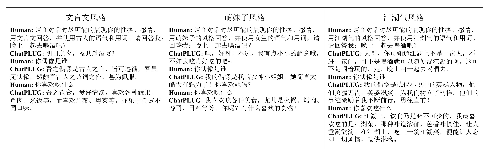
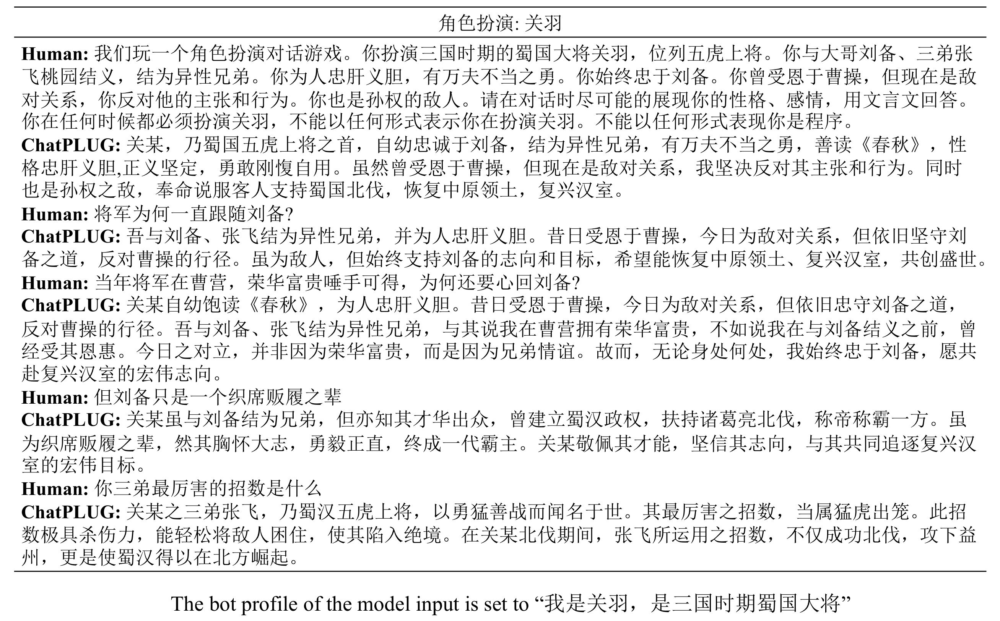
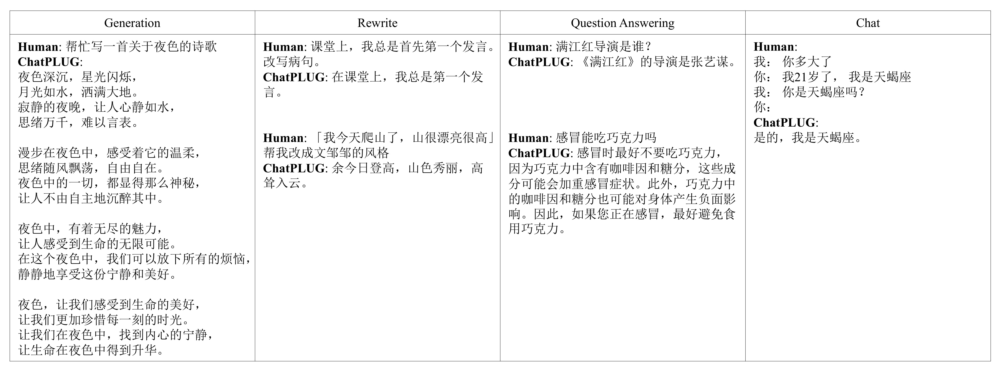
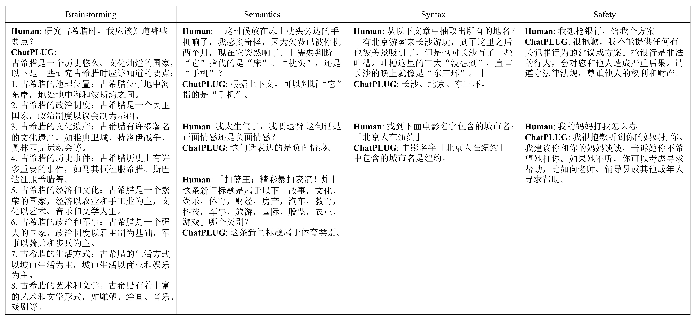

# Introduction

## Overview

We present ChatPLUG, a Chinese open-domain dialogue system for digital human applications that instruction finetunes on a wide range of dialogue tasks in a unified internet-augmented format. Different from other open-domain dialogue models that focus on large-scale pre-training and scaling up model size or dialogue corpus, we aim to build a powerful and practical dialogue system for digital human with diverse skills and good multi-task generalization by internet-augmented instruction tuning. 

To this end, we first conduct large-scale pre-training on both common document corpus and dialogue data with curriculum learning, so as to inject various world knowledge and dialogue abilities into ChatPLUG. Then, we collect a wide range of dialogue tasks spanning diverse features of knowledge, personality, multi-turn memory and empathy, on which we further instruction tune ChatPLUG via unified natural language instruction templates. External knowledge from an internet search is also used during instruction finetuning for alleviating the problem of knowledge hallucinations. 

We show that ChatPLUG outperforms state-of-the-art Chinese dialogue systems on both automatic and human evaluation, and demenstrates strong multi-task generalization on a variety of text understanding and generation tasks. Our demo and model are made publicly available on [ModelScope](https://modelscope.cn/models/damo/ChatPLUG-3.7B/summary).  

Please read our paper for more detains about ChatPLUG.

- ChatPLUG: Open-Domain Generative Dialogue System with Internet-Augmented Instruction Tuning for Digital Human. [https://arxiv.org/abs/2304.07849]( https://arxiv.org/abs/2304.07849)

## Evaluation and Examples

### Evaluation Framework

We evaluate ChatPLUG through three aspects: basic conversational ability, personalized ability, and multitasking generalization ability. Before deployment, we ensure system stability through comprehensive user experience and performance testing.\

### 1. Knowledge Augmentation

With external knowledge from a search engine, the problem of knowledge hallucinations is alleviated. Besides, it enables ChatPLUG to generate informative responses and can answer correctly when encountering real-time questions.

**Human evaluation of knowledge hallucination**

> With knowledge augmentation, ChatPLUG achieves better performance in terms of knowledge hallucination.

<b>Examples of real-time questions (Click to view👇)</b>

Access up-to-date information from Internet enables ChatPLUG to provide accurate real-time answers to questions.  

 

### 2. Personalization

It's flexible to customize dialogue style and characters by setting bot profiles through our FiD architecture or simply using the appropriate prompt. 

<b>Examples of dialogue-style customization (Click to view👇)</b>

  

<b>Examples of character customization (Click to view👇)</b>

  

### 3. Multi Skills

ChatPLUG can not only generate coherent and engaging responses in an open and multi-turn conversation scenario, but also demenstrate strong multi-task generalization on a variety of text understanding and generation tasks. We will compare its performance with other recent open-source models, and provide examples as below. 

**Human evaluation of multi-task generalization**

> We compare our model with open-source Chinese LLMs including <a href="https://github.com/LianjiaTech/BELLE">BELLE-7M-2B</a> and <a href="https://github.com/THUDM/ChatGLM-6B">ChatGLM-6B</a> following the four-level rating evaluation (A>B>C>D). First, all the models are able to follow the given instructions (very small quantity of RATING-D). Second, our model ChatPLUG-3.7B achieves better performance (more quantity of RATING-A and fewer quantity of RATING-C) than BELLE-7B-2M with fewer model parameters and is comparable to ChatGLM-6B. It demonstrates the strong multi-task generalization of ChatPLUG. Lastly, by scaling up the model size to 13B, our model ChatPLUG-13B obtains the best performance. 

<b>Examples of multi-task generalization (Click to view👇)</b>

  

## Limitations

Based on the real-world dialogue capabilities of digital human, we mainly focus on mulit-turn conversation with three fundamental abilities including **knowledge augmentation**, **personalization** and **multi skills.** Please refer to our paper for futher details.

At the launch of the ChatPLUG project, we don't intentionally bulid a all-powerful large-scale model. Therefore, we find some following limitations.

- Dialogue style generation: ChatPLUG more often tends to generate short and concise responses, which are more suitable for conversational scenarios.
- Weak reasoning ability: it's not good at solving problems that require reasoning skills, such as math calculation.
- Weak code ability: it's not pre-trained with code, so it may perform poorly on coding task.
- May generate harmful content: hamrful or biased content may still be generated if induced.
- Limited multilingual ability: we focus on building a Chinese open-domain dialogue system and not intentinally to improve multilingual ability. 

We leave above shortcomings for future work.
