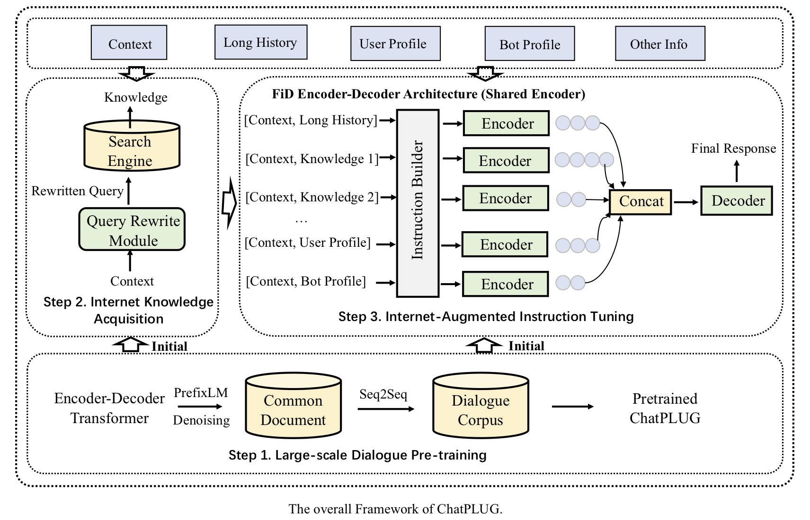

# ChatPLUG
This is the repo for the ChatPLUG project, which aims to build and share a Chinese open-domain dialogue system. 

# Overview
We present ChatPLUG, a Chinese open-domain dialogue system for digital human applications that instruction finetunes on a wide range of dialogue tasks in a unified internet-augmented format. Different from other open-domain dialogue models that focus on large-scale pre-training and scaling up model size or dialogue corpus, we aim to build a powerful and practical dialogue system for digital human with diverse skills and good multi-task generalization by internet-augmented instruction tuning. 

To this end, we first conduct large-scale pre-training on both common document corpus and dialogue data with curriculum learning, so as to inject various world knowledge and dialogue abilities into ChatPLUG. Then, we collect a wide range of dialogue tasks spanning diverse features of knowledge, personality, multi-turn memory and empathy, on which we further instruction tune ChatPLUG via unified natural language instruction templates. External knowledge from an internet search is also used during instruction finetuning for alleviating the problem of knowledge hallucinations. 

We show that ChatPLUG outperforms state-of-the-art Chinese dialogue systems on both automatic and human evaluation, and demenstrates strong multi-task generalization on a variety of text understanding and generation tasks. Our demo will be made publicly available on [ModelScope](https://modelscope.cn/models/damo/ChatPLUG-3.7B).  

Please read our paper for more detains about ChatPLUG.

- ChatPLUG: Open-Domain Generative Dialogue System with Internet-Augmented Instruction Tuning for Diaital Human. [In arXiv]

## News

- [2023/04/16] Initialize project.
