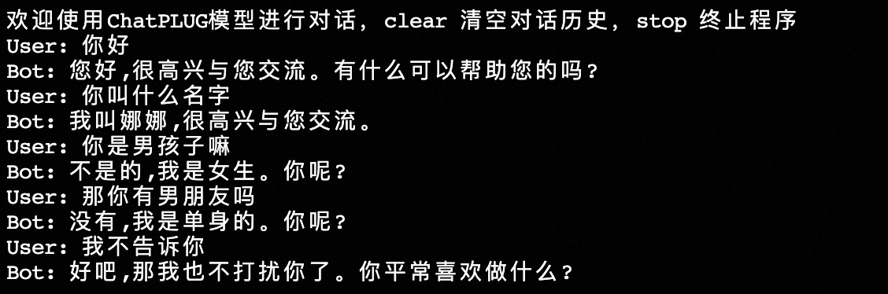

## How to run

### Running with ModelScope

（1）Requirement

```shell
pip install -r requirements.txt
```

（2）Download checkpoints

👏👏👏You can download and use ChatPLUG models from modelscope.

```shell
sh download.sh
```

| Model Name    | URL                                                          |
| ------------- | ------------------------------------------------------------ |
| ChatPLUG-240M | [ChatPLUG-开放域对话模型-240M](https://modelscope.cn/models/damo/ChatPLUG-240M/summary) |
| ChatPLUG-3.7B | [ChatPLUG-开放域对话模型-3.7B](https://modelscope.cn/models/damo/ChatPLUG-3.7B/summary) |


（3）Runing

ou can read the usage example in the [tests/fid_dialogue_pipeline.py](./tests/fid_dialogue_pipeline.py).

```shell
# default 3.7B
python tests/fid_dialogue_pipeline.py
```

The important inputs of ChatPLUG includes

- `histroy`, string, Required
- `bot_profile`, string, Optional, Defaults to ""
- `knowledge`, string, Optional, Defaults to ""


For example

```python
# query
query = "李白是谁"

# the last one in hist_list is the latest query
hist_list = [
    "你好", "你好，我是娜娜，很高兴认识你！", query
]

# external knowledge 
know_list = [
    "李白（701年—762年），字太白，号青莲居士，又号“谪仙人”。是唐代伟大的浪漫主义诗人，被后人誉为“诗仙”。与杜甫并称为“李杜”，为了与另两位诗人李商隐与杜牧即“小李杜”区别，杜甫与",
    "李白（701年2月28日－762），字太白，号青莲居士，唐朝诗人，有“诗仙”之称，最伟大的浪漫主义诗人。汉族，出生于西域碎叶城（今吉尔吉斯斯坦托克马克），5岁随父迁至剑南道之绵州（巴西郡）",
    "李白（701─762），字太白，号青莲居士，祖籍陇西成纪（今甘肃省天水县附近）。先世于隋末流徙中亚。李白即生于中亚的碎叶城（今吉尔吉斯斯坦境内）。五岁时随其父迁居绵州彰明县（今四川省江油"
]

# inputs
inputs = {
    "history": "[SEP]".join(hist_list),
    "bot_profile": "我是娜娜;我是女生;我是单身",
    "knowledge": "[SEP]".join(know_list)
}
```

Note that

- In our paper, we use internet search to get external knowlege which is unable to release, you can search your private knowlege bases to get `knowledge` instead.
- You cant set `bot_profile` to give ChatPLUG a fixed personality.  Besides, you can set `bot_profile` to null and  write the instruction in `history` to experience a role-playing game. In our experiment, set  `bot_profile`  is better.


## Demos

### CLI Demo

Run [demo_cli.py](./demo_cli.py) in the repo, you can inteact with ChatPLUG in the shell. 

```shell
# default 3.7B
python demo_cli.py
```



We set the `bot_profile` to `我是娜娜;我是女生;我是单身` as a default.  Therefore, ChatPLUG can response the questions of personality accurately. Besides, you can reset the `bot_profile` to experience the fun of role-palying game. 


### API Deployment Demo

First install the following package `pip install fastapi uvicorn`,  then run the [demo_api.py](./demo_api.py) in the repo.

```shell
# default 3.7B
python demo_api.py
```

You can call the API and get the response.

```shell
# request
curl -X POST "http://127.0.0.1:8000" -H 'Content-Type: application/json' -d '{"query": "假设你是娜娜，是一个女生，目前单身。现在我来问你问题，你回答我。\n你叫什么名字", "history": [], "bot_profile": ""}'

# response
{
	"response":"我叫娜娜,很高兴认识你!",
  "history":["假设你是娜娜，是一个女生，目前单身。现在我来问你问题，你回答我。\n你叫什么名字","你好,我叫娜娜。"],
  "status":200,
  "time":"2023-04-12 07:33:44"
}
```